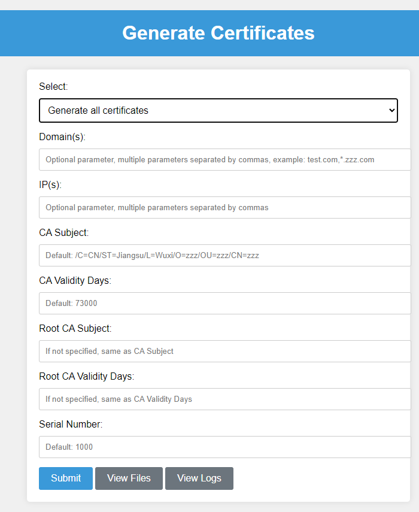
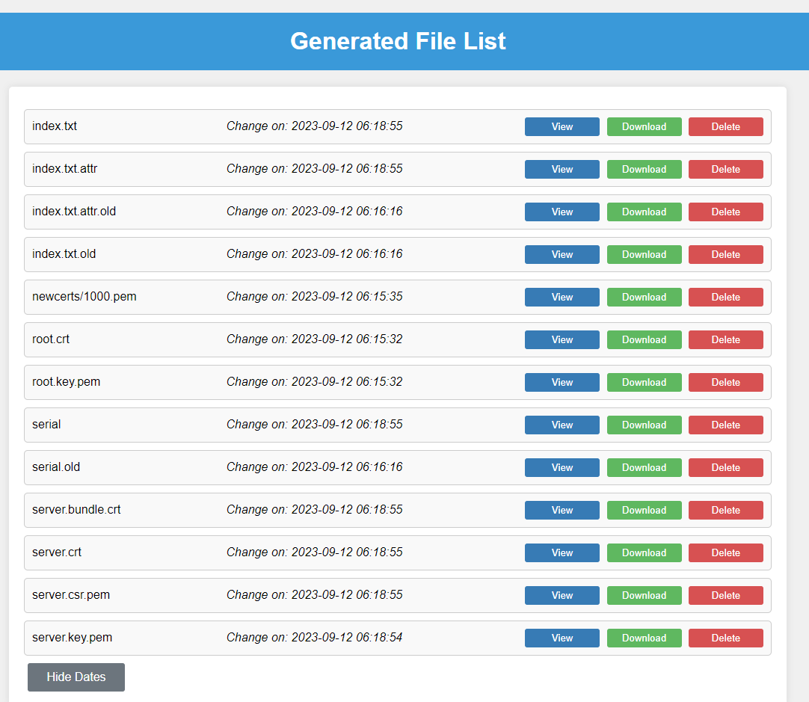
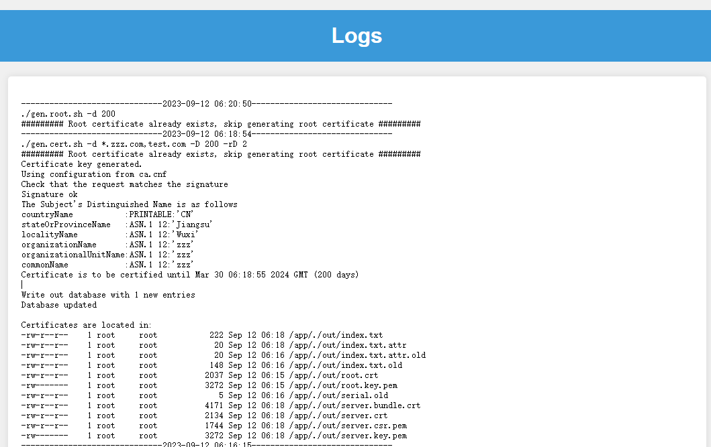

# self-signed-certificate

This project provides a simple web or script-based solution for generating self-signed certificates using the Gin web framework. The generated certificates are stored in the "out" directory under the current working directory. By default, the root certificate is only generated once, and it can be manually deleted from the directory to regenerate it if needed.

### Example







### Usage

Build Docker Image

```
docker build -t self-signed-certificate:v1 .
```

Run Docker Container

```
docker run --name self-signed-certificate \
  --restart always \
  -p 8000:8000 \
  -d self-signed-certificate:v1
```

Usage with Kubernetes

```
# modify self-signed-certificate.yaml
kubectl -n xxx apply -f self-signed-certificate.yaml
```

### Appendix

If you don't need to use the Gin web interface, you only need three files: ca.cnf, gen.cert.sh, and gen.root.sh. You don't need to modify any files.

Generate All Certificates

```
./gen.cert.sh -h

Usage: ./gen.cert.sh [-d domain, optional parameter, multiple parameters separated by commas ] 
       [-i ip, optional parameter, multiple parameters separated by commas ] 
       [-s ca subject, defalut: /C=CN/ST=Jiangsu/L=Wuxi/O=zzz/OU=zzz/CN=zzz ] 
       [-D ca validity days, default: 73000 ] 
       [-rs root ca subject, If not specified same to -s ] 
       [-rD root ca validity days, If not specified same to -D ] 
       [-sn serial number, default: 1000 ]

example:
./gen.cert.sh -d 'test.com,*.zzz.com' -i '1.1.1.1,192.168.102.60'
```

Generate Root Certificate Only

```
./gen.root.sh -h

Usage: ./gen.root.sh [-s root ca subject, defalut: /C=CN/ST=Jiangsu/L=Wuxi/O=zzz/OU=zzz/CN=zzz Root CA ] 
         [-d validity days, default: 73000 ] 
         [-sn serial number, default: 1000 ]
```

Delete Certificate Directory

```
rm -rf ./out/
```

### References

[Fishdrowned/ssl](https://github.com/Fishdrowned/ssl/)
